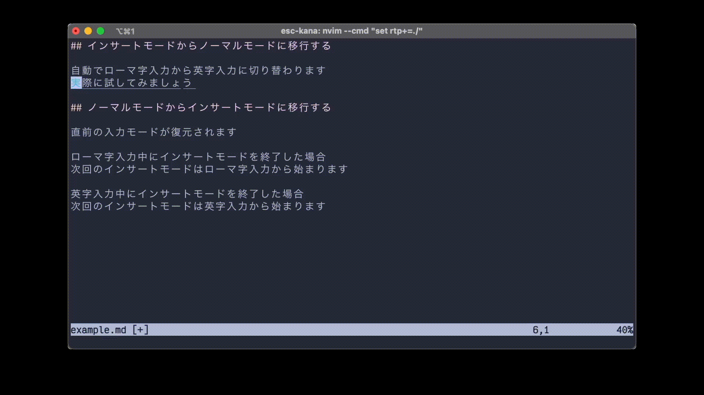

# esc-kana

> This is a neovim plugin for optimizing Japanese input methods.
> For obivous reasons, the rest of README is written only in Japanese.

## 要約

以下のデモ映像をご覧ください．



## 機能の説明

### vim/neovim は日本語との相性が悪い

ノーマルモードにおいて「j」や「k」等のキーを使ってカーソルを動かします．
しかし，ローマ字入力状態では「j」キーを押してもカーソル移動が行われません．
そのために，日本語で vim/nvim を使うには以下のような手順を踏む必要がありました．

1. インサートモード：ローマ字入力で日本語を書く
2. インサートモード：Esc キーを押してノーマルモードに移行する
3. **ノーマルモード：ローマ字入力から英字入力に切り替え**
4. ノーマルモード：カーソルの移動

これが原因で，ユーザーは以下のような不便な思いをすることになります．
効率や利便性の観点から，これは問題です．

- インサートモードに入るたびにローマ字入力に切り替えなければならない
- ノーマルモードに入るたびに英字入力に切り替えなければならない
- ユーザー自身が現在のインプットメソッドを記憶しなければならない

### esc-kana を使うと日本語入力が楽になります

esc-kana は，

> 2. インサートモード：Esc キーを押してノーマルモードに移行する

において，Esc キーが入力された際に

> 3. ノーマルモード：ローマ字入力から英字入力に切り替え

の操作を自動で行います．

これにより，ユーザーは以下のような利益を享受できます．

- インサートモードに入るたびにローマ字入力に切り替える必要はない
- ノーマルモードに入るたびに英字入力に切り替える必要はない
- ユーザー自身が現在のインプットメソッドを記憶しなくても良い

## インストール方法

**現在，この plugin は macOS にのみ対応しています．**

### 必要な環境

- homebrew がインストールされていること

### ステップ 1. im-select をインストールします

```bash
brew tap daipeihust/tap && brew install im-select
```

### ステップ 2. esc-kana を好きなパッケージマネージャを使ってインストールします．

以下に，主要なパッケージマネージャを使って esc-kana をインストールする方法を示します．
お使いのパッケージマネージに応じて，一つのみ実行すれば十分です．

Packer.nvim でインストールする場合

```bash
use({'keita-ishizuka/esc-kana'})
```

vim-plug でインストールする場合

```bash
Plug 'keita-ishizuka/esc-kana'
```

dein でインストールする場合

```bash
call dein#add('keita-ishizuka/esc-kana')
```

minpac でインストールする場合

```bash
call minpac#add('keita-ishizuka/esc-kana')
```

## FAQ

> MacOS で使えますか？

使えます．

> Linux で使えますか？

使えません．
対応予定です．

> Windows で使えますか？

使えません．
対応予定はありません．

> neovim で使えますか？

使えます．

> vim で使えますか？

使えません．
対応予定はありません．
